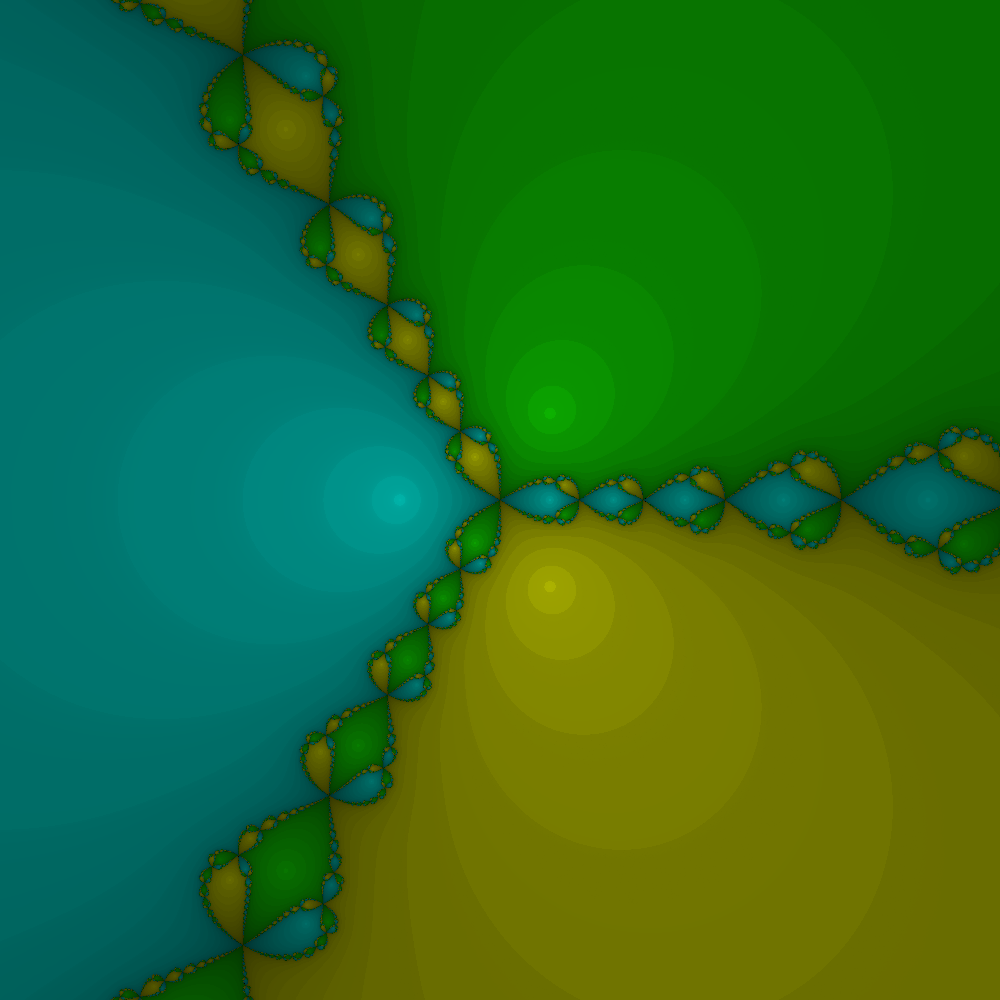
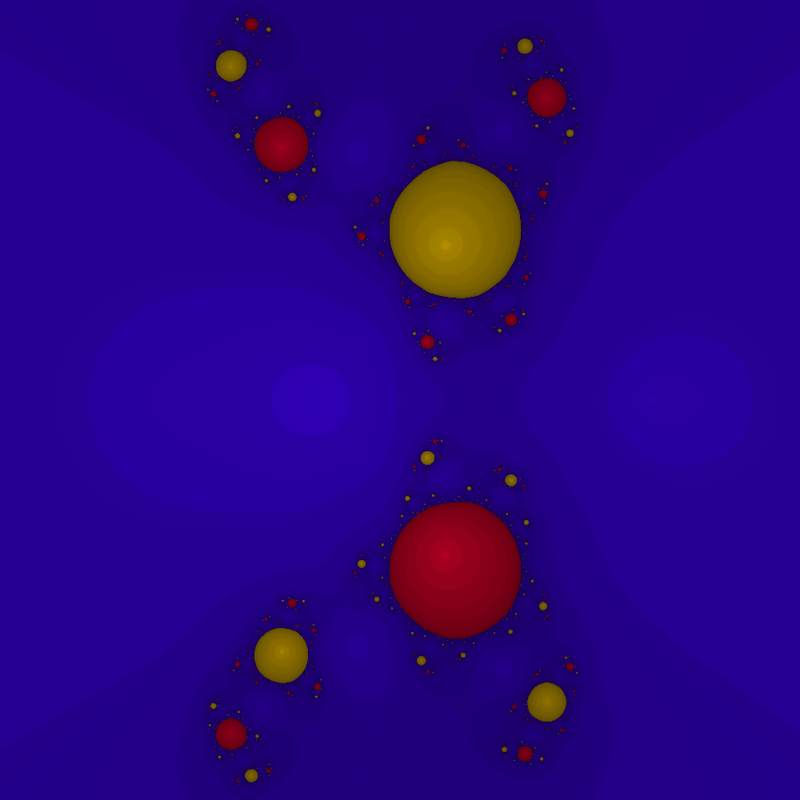
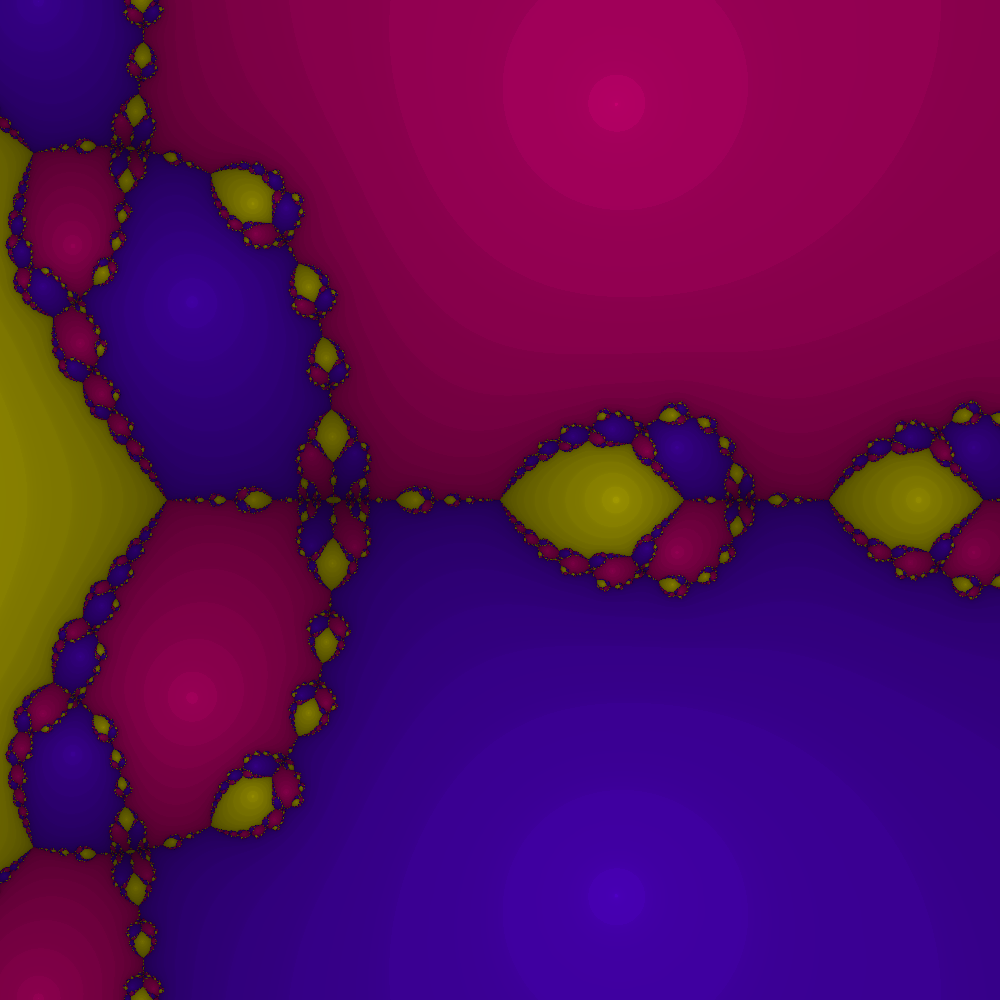

# Blazor Fractals

A generator of fractal images based on complex functions and Newton's root-finding method.

The entire app runs on Blazor WebAssembly and is hosted on GitHub pages: https://fernando.andreu.info/blazor-fractals

The image generation algorithm can run directly on the browser as well. However, due to some technical
limitations in WebAssembly, this can be significantly slow than if run under a local machine. As a workaround,
this algorithm can also be triggered from an Azure Function.

## How it works

The Newton's method is used to find the roots of a single-variable function `f(z)` such as:

<pre>
zi+1 = zi - m * f(z) / f'(z)
</pre>

If the error between the previous and current `z` value is sufficiently small, the solution has converged.
The first `z` guess is quite important, as it can determine whether a solution is found or not, and which one 
in particular.

The fractal generation algorithm simply runs the Newton's method repeatedly, assigning a different `z` guess for
each pixel of the image. Then, each pixel is given a base color depending on the specific solution reached, or a
default one if there was no convergence. Some additional algorithm parameters (depth, gradient) are used to alter
this base color and make the image a bit more aesthetically pleasing.

## Algorithm parameters

#### Expression

A string representing the function whose roots will be found. The following tokens are recognised by the parser:

- Operators: `*`, `/`, `+`, `-`, `^`
- Brackets: `(`, `)`
- The complex variable `z`
- Constants: `pi`, `E`, `i`
- Functions: `sin`, `cos`, `tan`, `log`

#### Multiplicity

The `m` factor in the Newton's method above. A value of `1` is usually the default. Different values might make the
convergence impossible / very slow, but might also create interesting variations of the resulting image. For example,
values with an imaginary side, such as `1+0.8i`, will make the fractal appear like rotating respect to the origin.

#### Background color

This color will get used when no convergence has been achieved for a specific coordinate.

#### Bounds

The function domain to cover in the fractal image. For example, the min real bound will be mapped to the left edge of
the image, while the max real bound will be mapped to the right edge.

#### Max iterations

Maximum number of iterations to attempt for each pixel before assuming no convergence can be reached. Increasing this
value might cause some blank areas to be coloured instead, at the expense of computation time.

#### Precision

The target error to achieve, in terms of difference between between current / previous `z` values, before assuming the
solution has converged.

#### Depth

The brightness of each pixel can be adjusted depending on the number of iterations needed to converge. This parameter
controls the rate of change from one iteration to the next. High values can create excessively darker pictures. This
can also be negative; however, the base color will need to have less than 100% brightness to see any impact. Set it to
0 to disable any effect.

#### Threshold

Skip a certain amount of iterations when adjusting the brightness based on the `Depth` parameter. This is particularly
useful when the function being evaluated needs a significant amount of iterations on average.

#### Gradient

This parameter attempts to remove the clearly defined brightness boundaries caused by the `Depth` parameter, hence
resulting in a smoother picture. This is done based on how close the previous iteration was from the final solution. It
might not work well  in all cases, and has a risk of overshooting (i.e. causing those boundaries to be even more 
visible).

## Screenshots

z^3+1:

(z^3+z+1)/(z^2+1):

z^3+z^2+1:

